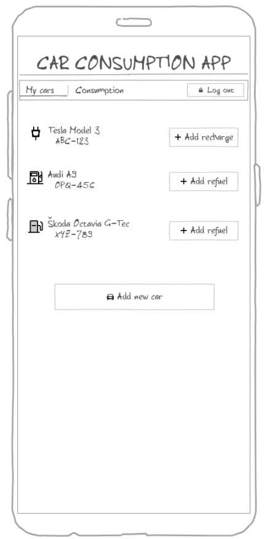
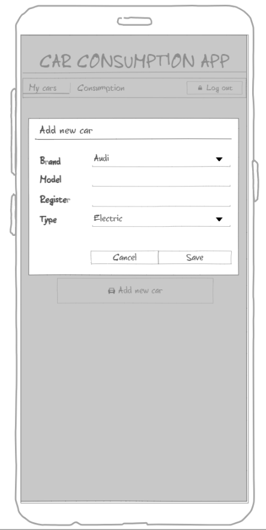
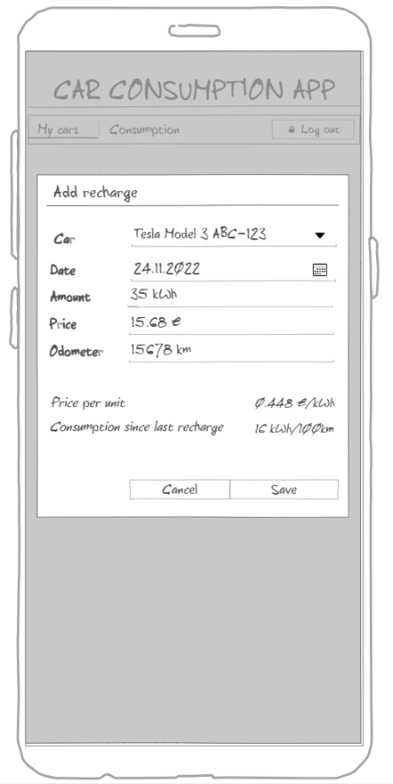
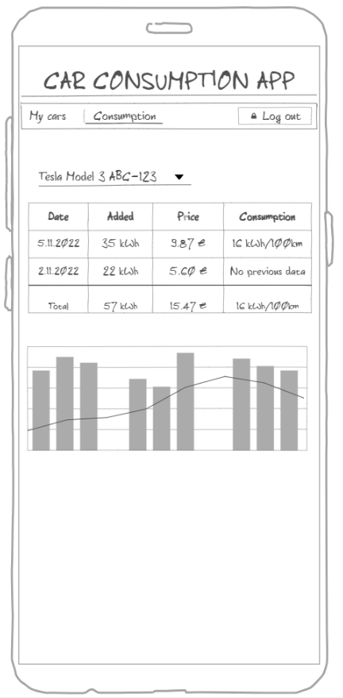
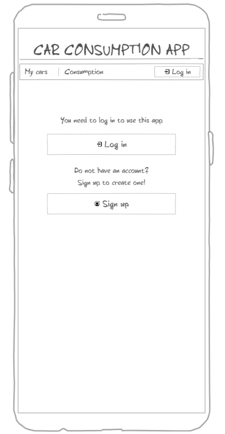
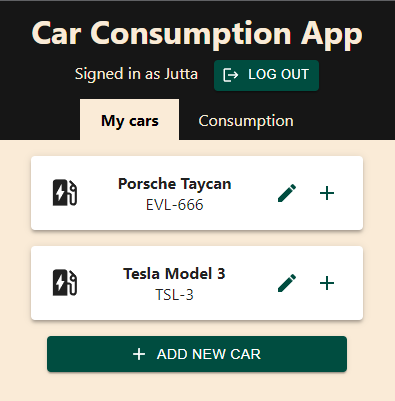
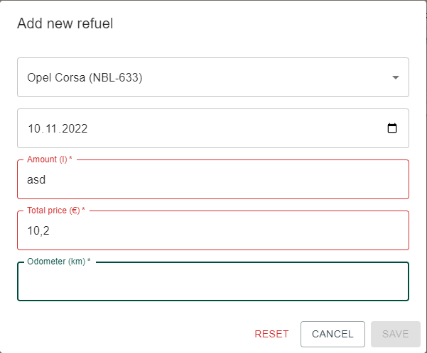
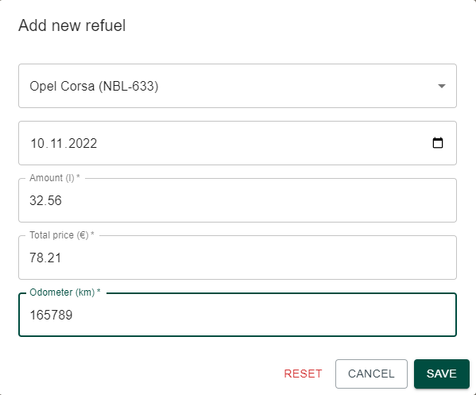
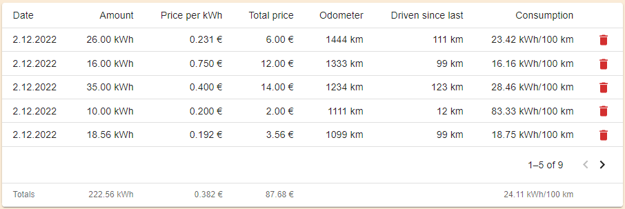
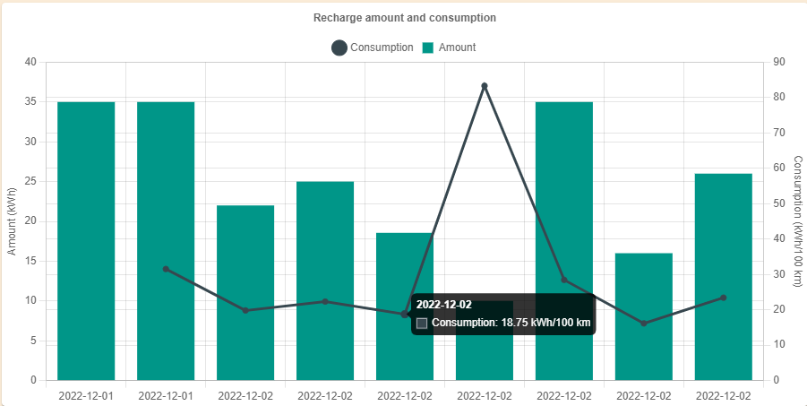

*This app was built with Create React App as a course work for Web User Interface Programming course in autumn 2022*
*and approved with full grade. The below is the original course work documentation.*

---

# Car Consumption App

As the course research assignment I decided to continue further the last exercise in the course - 
the Car Consumption Monitoring app. The basic idea of the app is for users to enter data of 
refueling or recharging their cars and getting insights of their cars' consumption.

## Requirements

This app should be web application deployed on a web server to be accessible anywhere anytime. 
Feature requirements from the user's perspective are gathered below in the form of user stories. 
More detailed requirements can be found under [acceptance criteria](#acceptance-criteria).

| Initial user story | Feature/Component |
| :-- | :-: |
| As an owner of several cars I want to add data for each separately | [Cars](#cars) |
| As a car owner I want to save data about refuel/recharge events so that I can monitor my car's consumption and costs | [Refuel](#refuelrecharge) |
| As a car owner I want to see and edit history of my refuel/recharge events | [History](#history) |
| As a car owner I want to see totals for history for each car separately and all of my cars together | [History](#history) |
| As a car owner I want to see my cars' consumption visualized | [Visualizations](#visualizations) |
| As a car owner I want my cars' data only to be visible to me | [Login/Auth](#loginauth) |

### Acceptance criteria

#### Cars

When user starts to use the app they need to enter basic data for at least one car.
Details for a car include brand, model and register number as free text in 
addition to car type: petrol/diesel/electric/natural gas.
Refule/recharge records are linked to a specific car with car id.

There is no limit how many cars one user can create. 

 

#### Refuel/Recharge

User can enter the following data for a refuel/recharge event:

* date (default current date)
* fueled/charged amount
* full paid amount
* kilometers from odometer

Based on entered data app will calculate:

* price per unit
* average consumption per 100km since last refuel/recharge (if available)

Each refuel/recharge event is linked to a specific car. 
The units shown in the UI depend on the car type:

* petrol/diesel -> liter
* electric -> kWh
* natural gas -> kg

#### History

User can see refuel/recharge events in a table with calculated all time totals for costs and liters 
as well as all time averages for cost per unit and average consumption. 
User can remove or edit records

If user has several cars history also shows total costs/consumptions separately for each car type.

#### Visualizations

User can see their cars' consumption history in a graph. User can select which car(s) to show in the vizualisations. 
Visualizations can be shown on the same page as history table.

#### Login/Auth

User should be able to create an account and login with that account.
Only once logged in user can start to use the other features of the app.
Each car is linked to one user and only this user can see and edit the car's details and consumption.

## Implementation

### Tech in general

This app is initialized with [Create React App Redux template](https://react-redux.js.org/introduction/getting-started). 
With this template you get basis for a React Redux app out of the box and can quickly start to implement your app.

Instead of JavaScript I decided to use TypeScript, since I like type safety and have experience working 
with TS + Angular, so I wanted to try React + TS combination as well. 

This app also uses the following: 

* [Material UI](https://mui.com/) for beautiful and responsive UI components and [icons](https://mui.com/material-ui/material-icons/)
* [Firebase](https://firebase.google.com/docs/web/setup) for auth and database
* [Chart.js](https://www.chartjs.org/docs/latest/) with `react-chartjs-2` for visualizations
* [React Router](https://reactrouter.com/en/main) for routing

App UI theme colors are customized with the help of [Material Design color tool](https://m2.material.io/resources/color/).

### Authentication and storage

This app uses Firebase authorization for user management and Firestore for storing data. 
Firebase configuration and functions which interact directly with Firestore are collected in `firebase` directory. 

When the app starts it sets an oberver to user's sign-in state with Firebase's `onAuthStateChanged`. 
Once the state changes, it triggers a callback to set or clear current user details from Redux store with `authSlice`. This way app should always be up-to-date about the current user. 
If there is no signed-in user, the app will only show the `Login` component to prompt user to sign in or register to use the features.

Firestore has only two collections: `cars` for car documents and `events` for refuel/recharge event documents. 
Each document has field `userId` which corresponds to each user's uid. This way the app can only query those 
documents where the `userId` matches the currently logged in user and keep other users' data safe. 

Documents in `cars` collection have the following fields which are all of type `string`: 

* id
* brand
* model
* registration
* type (electic/petrol/diesel/natural gas)

Documents in `events` collection have the following fields:

* id: string
* carId: string (links event to a car)
* date: string
* amount: number
* price: number
* odometer: number

### Features and components

#### Cars feature

Cars can be added, edited and removed and all changes are immediately saved to Firestore. 
Cars are saved as a list in the Redux store to be available throughout the app. 

Getting cars list from Firestore uses Redux Toolkit's `createAsyncThunk` function. This makes it easy to 
handle the lifecycle of an async request such as fetching data from Firestore. Fetching cars from Firestore 
is invoked in the `App` component whenever auth state changes and also whenever user saves any changes 
in the `CarEditModal` component. 

#### Consumption feature

After user has added at least one car, user can start to add refuel/recharge events to collect consumption history. 
These events are generally referred to in the app as `refuels` not to confuse developer with HTML events. 
Refuels are saved in Redux store `refuelSlice` and there the functionality is basically the same as with cars. 

Entered consumption data is validated on the fly so that only numeric data with dot as decimal separator 
is accepted for the amount, total price, and odometer fields. Validations use the input element's `validity` 
state to check the validity with the set pattern. Fields' `onChange` event also triggers the `useEffect` to update 
the overall validity, so that `save` button is only enabled when fields are valid. This prevents user from entering 
invalid data, and also shows the validity state to user. 

 

User can see the consumption history for one car in the consumption component. There is a table with data from all 
individual events and calculated totals and averages. Table is paged so that it shows only 5 events at the time, 
not to flood the UI with a large table when there are lots of events. There is also visualization that shows the 
amount charged/fueled on each event as bar chart, as well as the average consumption for 100 km from each event 
as a line chart. 

 

If user has several cars of same type, there also appear a small summary table with total amount, price and average 
price per unit for all events for those cars. 

#### Modal components

Adding, editing and deleting both cars and refuel/recharge events happens in modals. 
Modal states are handled with Redux through `modalSlice` which is used for both modals (and could be used for other possible modals as well). 
The idea is to reduce repeated code by using same slice for different modals because modal state handling 
is basically the same for all modals. Another option for modal state handling would be using a custom hook like `useModal`.

